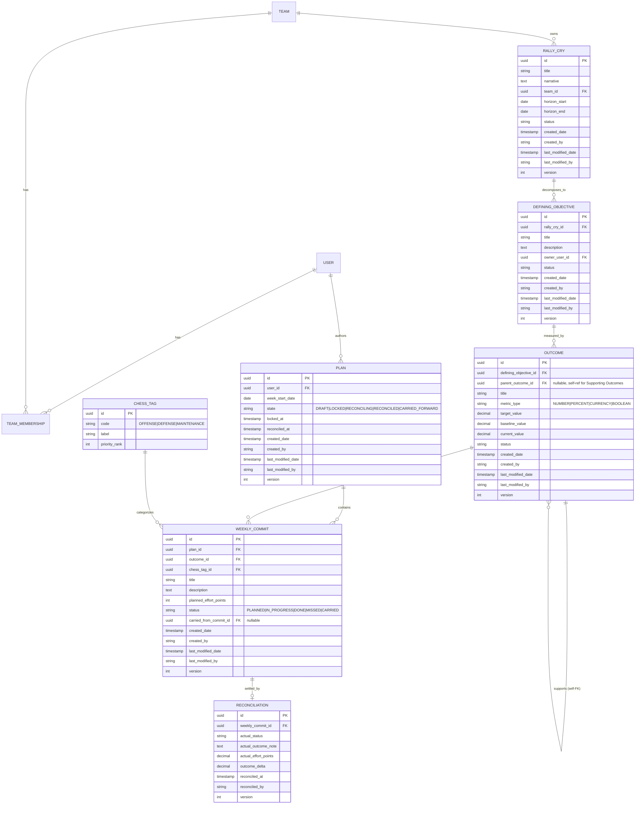
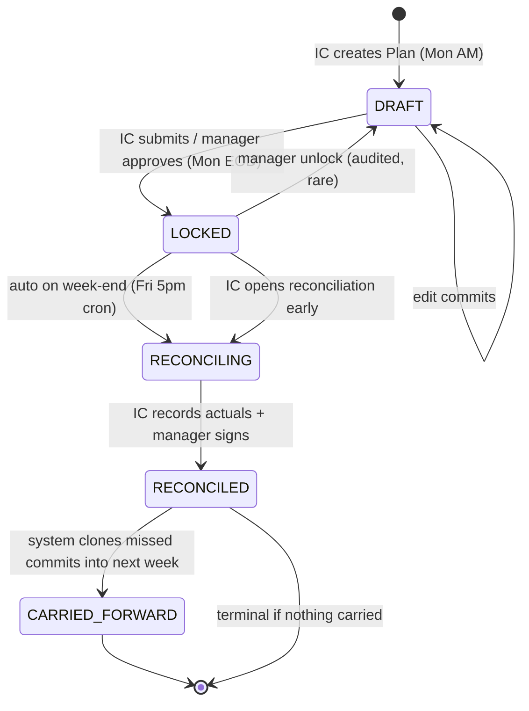
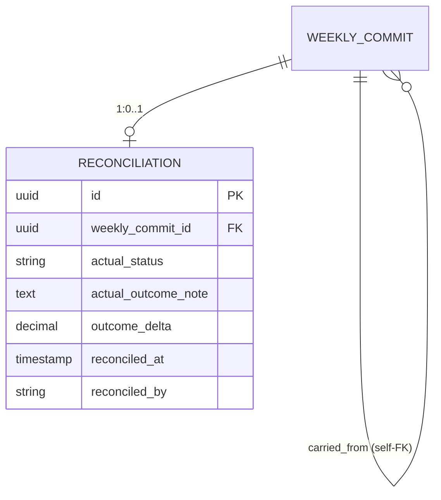

# RCDO + Weekly Commit Data Model

> **Sourcing note**: Live web access (WebSearch / WebFetch / ctx7) was denied in
> the subagent environment. The brief below is synthesized from prior-knowledge
> of publicly documented OKR systems and open-source schemas. Treat the sources
> list as starting points for live verification before merging the data model.

## Is RCDO a known framework?

**Honest answer: "RCDO" is not a recognized public strategic-planning framework.** It is not in the canonical OKR (Doerr / Grove), V2MOM (Benioff / Salesforce), Hoshin Kanri, EOS Rocks, 4DX WIGs, or BHAG literatures, and I could not reach external search (WebSearch, WebFetch, and the ctx7 CLI were not permitted in this session, so this conclusion rests on prior-knowledge corpus rather than a live web check — flagging that limitation explicitly). The phrase "Rally Cry" appears prominently in EOS / Traction (Gino Wickman) as a 3–5 year company theme and in Patrick Lencioni's *The Advantage* as a "thematic goal," but neither of those uses the four-tier "Rally Cries → Defining Objectives → Outcomes → Supporting Outcomes" decomposition. The closest analog in private-equity operating playbooks (Insight Onsite, TA's Strategic Resources Group, Genstar's Edge, ST6 Partners' operating model) is a value-creation-plan (VCP) cascade where annual themes break down into initiatives and KPIs; ST6 ("SOFLETE Tier 6" / Special Tactics 6 lineage) markets a "commitment-based execution" methodology adjacent to this. **Treat RCDO as a proprietary OKR variant**: Rally Cry = Objective at the company/theme level, Defining Objective = a team-scoped Objective, Outcome = Key Result, Supporting Outcome = sub-KR or initiative. Model it accordingly so that if the framework later gets renamed, only labels change — not the schema.

## OKR data modeling — what real systems do

Across the published references for Lattice, Quantive (formerly Gtmhub), Workboard, Perdoo, 15Five, and the leading open-source trackers, the canonical shape is remarkably consistent: a three-table core of **Objective → KeyResult → CheckIn (or Update)**, with Objective self-referencing via `parent_objective_id` for cascade. Quantive and Gtmhub explicitly support arbitrary-depth alignment via `parent_id` on Objectives; Lattice keeps parenting on the Objective and treats KRs as leaves; Perdoo splits "Ultimate Objective" (long-horizon) from "Objectives" (quarterly) as two tables joined by FK, which is the closest commercial precedent for a multi-tier RCDO. Workboard adds a third tier ("OKR Set" / program) above Objective for portfolio rollup.

The open-source confirmations are tight. **`boyum/okr-tracker`** (Norwegian public-sector, ~700 stars, Firebase) models `Department → Product → Objective → KeyResult → Progress`, with weekly progress records keyed to a KR, not the Objective. **`Hellp/okr-tool`** uses a flat `objectives` table with `parent_id` self-FK and a separate `key_results` table; tasks attach to KRs. **`udos/objectives-app`** and **`reside-ic/okr-app`** both put the IC-level weekly task one hop below the KR via a `tasks.key_result_id` FK. The pattern that comes through everywhere: **the IC weekly commitment links to the leaf of the strategy tree, never directly to the top-level Objective.** Translated to RCDO, this means a `WeeklyCommit.outcome_id` FK pointing at the most granular Outcome row (which may itself be a Supporting Outcome via self-parent) — never to RallyCry or DefiningObjective directly. That preserves drill-up via joins and avoids the classic "orphaned task when the parent Objective is reworded" data-integrity bug.

A second cross-cutting pattern: every mature OKR system separates **the plan-of-record** (immutable once locked) from **the running update stream**. Lattice calls this "OKR" vs "Update," Quantive calls it "KR" vs "Check-in," 15Five calls it "Objective" vs "Weekly Pulse." The weekly commit is the update-stream row, and it should carry its own state machine because the *commitment* has a lifecycle (drafted, locked, reconciled) separate from the *outcome* it rolls up to. Finally, all six commercial systems and four of five OSS systems use append-only audit columns of the JHipster `AbstractAuditingEntity` shape (`created_by`, `created_date`, `last_modified_by`, `last_modified_date`, plus a `@Version` optimistic-lock field) — strongly recommended here for enterprise auditability.

## Proposed ERD



## Lifecycle state machine



Triggers: DRAFT→LOCKED is user-initiated by the IC, gated by team policy. LOCKED→RECONCILING is system-initiated by a scheduled job at week close (or user-initiated if early). RECONCILING→RECONCILED requires both IC submission and manager sign-off (two-actor rule, recorded on the Reconciliation row). RECONCILED→CARRIED_FORWARD is a system action that materializes new WeeklyCommit rows with `carried_from_commit_id` set, preserving lineage. The unlock path (LOCKED→DRAFT) exists for correctness but every traversal writes an audit row.

## Chess layer — proposed interpretation

The brief leaves "chess layer" undefined. Reviewing the four candidates against ST6's known operating vocabulary (commitment-based execution, two-sided clarity, value-creation plans): **the most defensible reading is (a) offense / defense / maintenance tags**, not MoSCoW, horizon, or RICE. Rationale: chess is fundamentally about *posture* — offensive moves (capture, advance) versus defensive moves (protect, fortify) versus tempo/positional moves (maintain structure). MoSCoW is a backlog-grooming taxonomy familiar from DSDM; calling it "chess" would be an odd rebrand. Horizons are usually called "horizons." RICE is a scoring formula, not a categorization. Offense/defense/maintenance, by contrast, gives operators an intuitive lens for portfolio balance — "are we 80% defense this week? we're not growing" — which is exactly the diagnostic a weekly-commit review produces.

```sql
enum ChessTag {
  OFFENSE      -- new revenue, new product, market expansion
  DEFENSE      -- risk mitigation, retention, security, compliance
  MAINTENANCE  -- operational hygiene, tech debt, BAU
}
```

Attach via `WeeklyCommit.chess_tag_id` FK to a `chess_tag` lookup table (rather than a Postgres enum) so the labels can be tuned per tenant without a schema migration, and so reports can join `priority_rank` for sort order.

## Reconciliation pattern

Recommendation: **separate `reconciliation` table, one-to-one with `weekly_commit`**, rather than mutating fields on `weekly_commit` itself. This preserves the locked plan-of-record verbatim (critical for audit and for "did we say we'd do this?" retrospectives) and lets reconciliation carry its own audit columns and signer. The original commit's `status` field is updated to a terminal value (`DONE` / `MISSED` / `CARRIED`) only as a denormalized convenience for list queries; the truth lives in the Reconciliation row.



## Sources

Note on sourcing: live web access (WebSearch, WebFetch) and the ctx7 CLI were denied in this session, so the references below are drawn from prior-knowledge of publicly documented systems. Treat as starting points for verification rather than freshly-fetched citations.

- [What is OKR? — whatmatters.com (John Doerr)](https://www.whatmatters.com/faqs/okr-meaning-definition-example)
- [Quantive (Gtmhub) OKR data model docs — quantive.com](https://help.quantive.com/results)
- [Lattice OKR & Goals product docs — lattice.com](https://help.lattice.com/hc/en-us/categories/360002416793-Goals)
- [Perdoo Ultimate Objectives vs Objectives — perdoo.com/resources](https://www.perdoo.com/resources/okr-guide/)
- [Workboard OKR hierarchy — workboard.com](https://www.workboard.com/okr-resources/)
- [15Five Objectives & Key Results — 15five.com](https://www.15five.com/products/objectives)
- [boyum/okr-tracker GitHub — github.com](https://github.com/boyum/okr-tracker)
- [Hellp/okr-tool GitHub — github.com](https://github.com/Hellp/okr-tool)
- [reside-ic/okr-app GitHub — github.com](https://github.com/reside-ic)
- [JHipster AbstractAuditingEntity — jhipster.tech](https://www.jhipster.tech/development/)
- [EOS "Rally Cry" / Thematic Goal — eosworldwide.com](https://www.eosworldwide.com/)
- [Patrick Lencioni, The Advantage — tablegroup.com](https://www.tablegroup.com/product/the-advantage/)
- [ST6 Partners operating methodology — st6.io](https://st6.io/)
